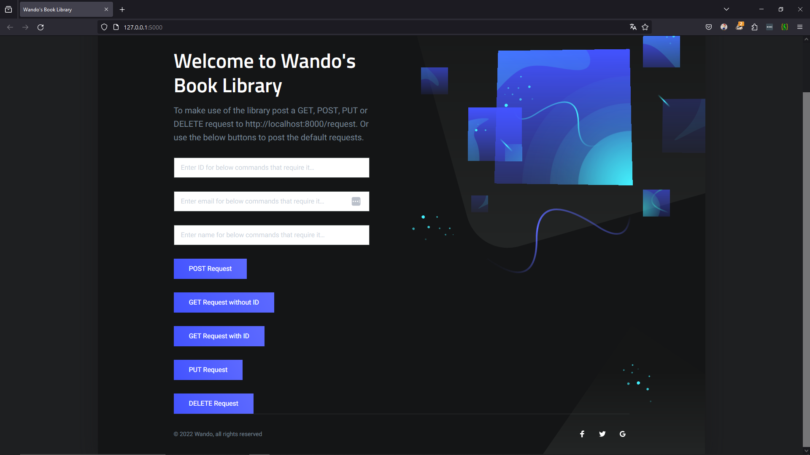
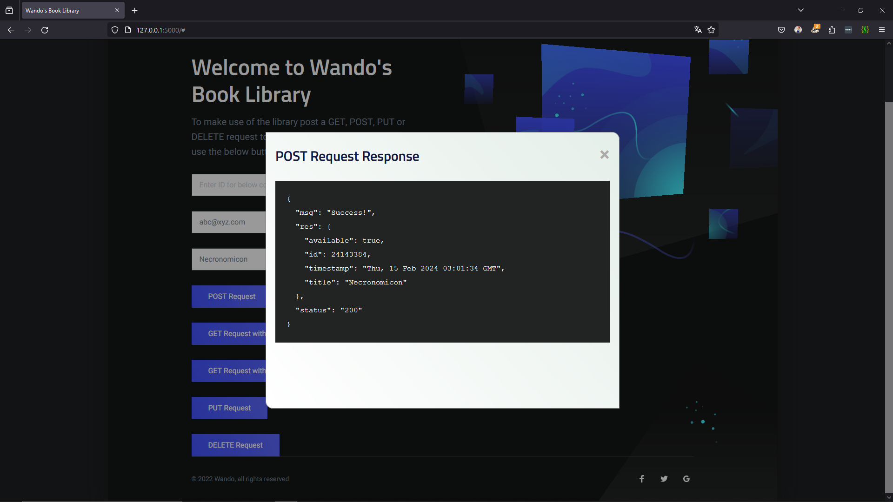
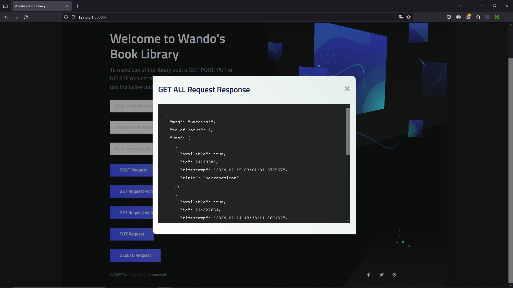

# Flask Book API Server

## Visão geral:

Esse é um projeto em python, feito com Flask, para montar um CRUD de uma biblioteca.

HTML e CSS já prontos, feitos por Hillary Wando (@Wandonium).

## Progresso:
- [x] ~~Criação de funções para ações no banco~~
- [x] ~~Criação de rotas e suas funções~~
- [ ] Documentação - WIP
- [ ] Testes
- [ ] Modificações e limpeza de código

## Rotas e funções:

### Página inicial:


Nada muito complicado ao carregar a página, somente uma função padrão do Flask:
```python
def index():
  return render_template('index.html')
```
E uma funçao para verificação de email, utilizada mais para frente:
```python
def isValid(email):
    regex = re.compile(r'([A-Za-z0-9]+[.-_])*[A-Za-z0-9]+@[A-Za-z0-9-]+(\.[A-Z|a-z]{2,})+')
    if re.fullmatch(regex, email):
        return True
    else:
        return False
```
***
### POST:


Contem a função postRequest(), onde ele:
<ul>
  <li>
  Recebe o request:
    
  ```python
    req_data = request.get_json()
  ```
    
  </li>
  <li>
  Verifica se o email é válido:
    
  ```python
    email = req_data['email']
    if not isValid(email):
        return jsonify({
            'status':'422',
            'res':'failure',
            'error':'Invalid email format. Please enter a valid email address.'
        })
  ```  
  </li>
  <li>
  Salva o email e verifica se o livro já existe:
  
  ```python
        title = req_data['title']
        bks = [b.serialize() for b in db.view()]
        for b in bks:
        if b['title'] == title:
            return jsonify({
                'res': f'Error! Book with title {title} is already in library!',
                'status': '404'
            })
  ```
  </li>
  <li>
  E insere o livro no banco:

  ```python
  bk = Book(db.getNewId(), True, title, datetime.datetime.now())
  db.insert(bk)

  return jsonify({
        'res': bk.serialize(),
        'status': '200',
        'msg': 'Success!'
    })
  ```
  </li>
</ul>

### GET all:


### GET id:


### PUT:


### DELETE id:


## Link original:

https://medium.com/@hillarywando/how-to-create-a-basic-crud-api-using-python-flask-cd68ef5fd7e3
